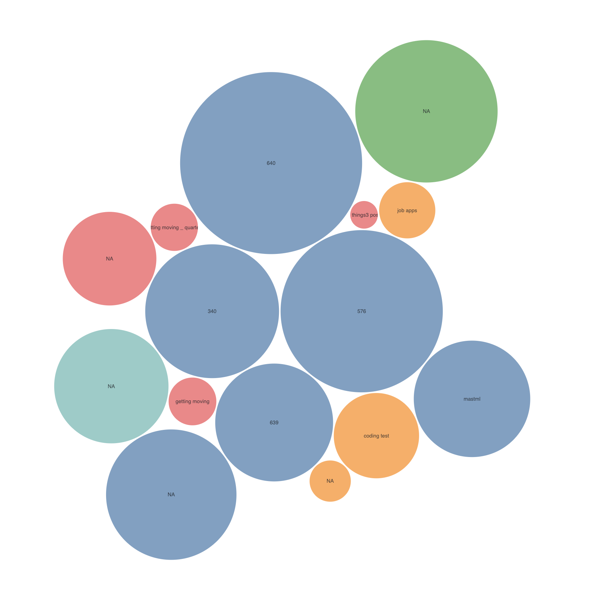
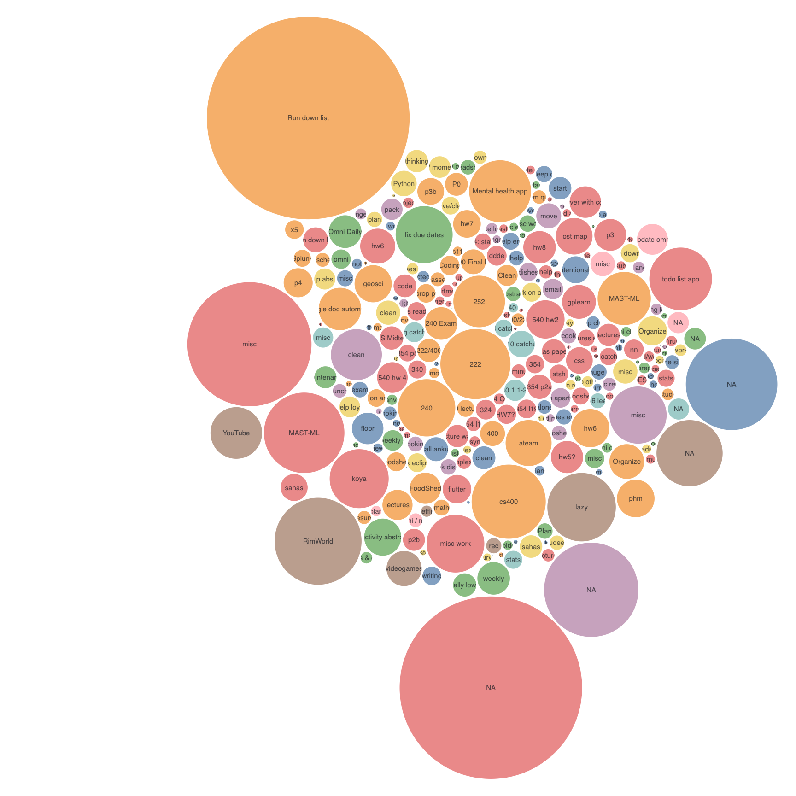
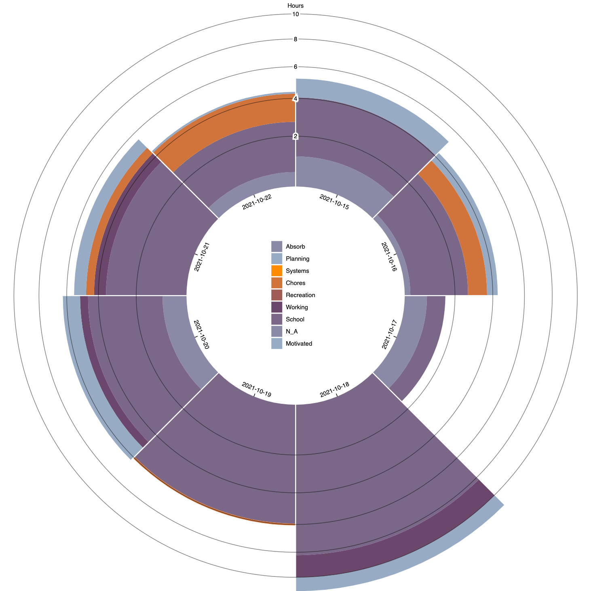
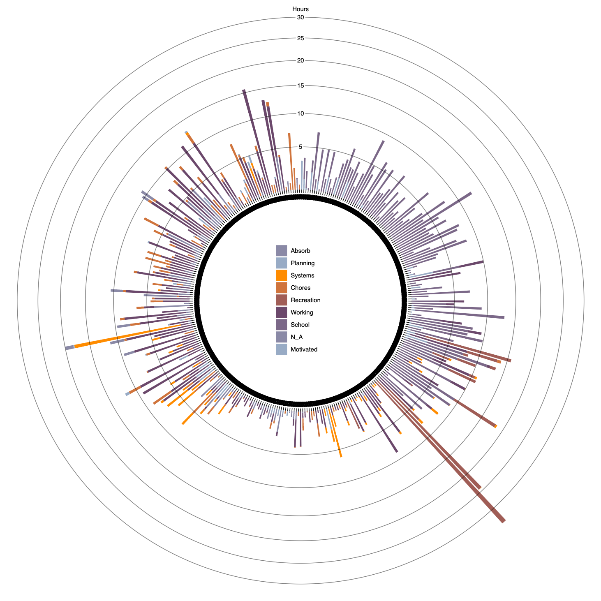
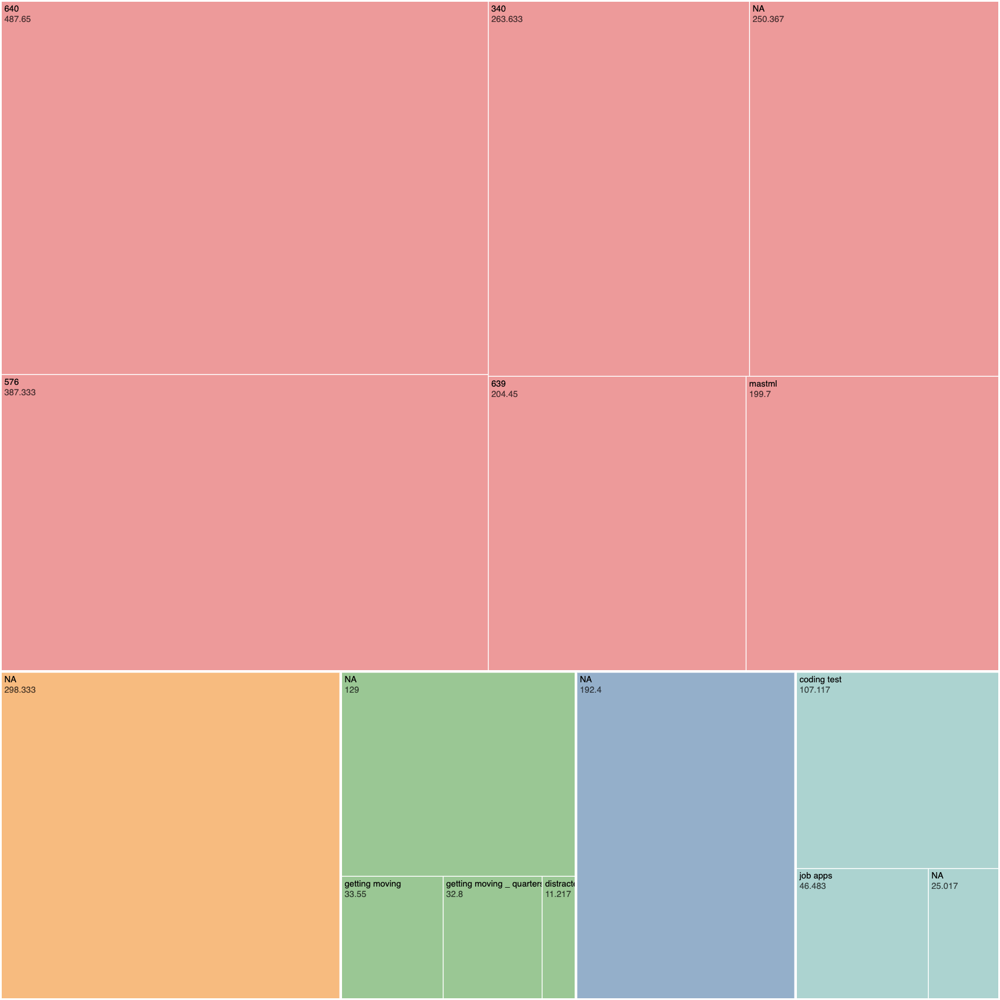
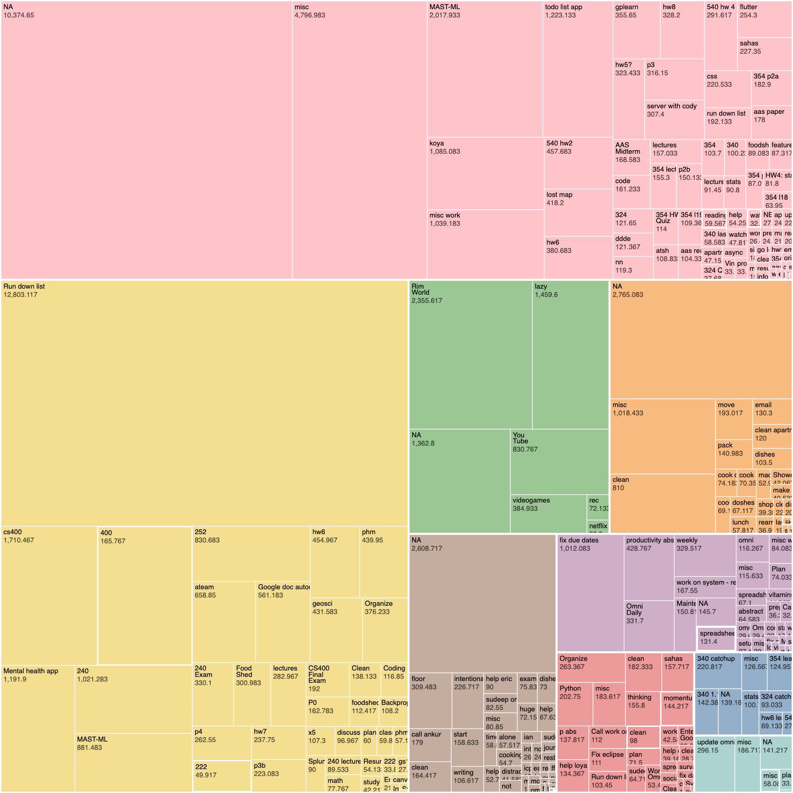

# PersonalVisualization

I wanted to do this for a while and now a class forces/allows me to do so.

## Images

### Bubble Chart Week

### Bubble Chart Year

### Radix Week

### Radix Year

### Tree Map Week

### Tree Map Year

