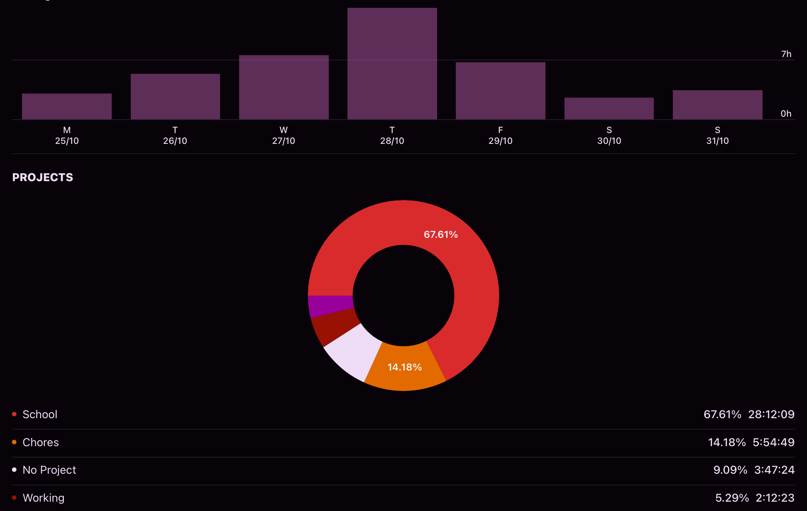

# PersonalVisualization

- [Assignment](#assignment)
- [Extra](#extra)
- [Appendix](#appendix)

## Assignment

Below is my static visualization, a treemap that encodes the work done over one week. My data had three main factors: task, category, and time. Each block is a specific label for tasks I did. Color corresponds to the category of the task. Lastly, the area corresponds to the time spent on that task. The purpose of this visualization was to understand where my time was spent.

A limitation of this visualization is I was inconsistent in naming my tasks. For example, I may have had four assignments for my 576 class that I did over the week, but I labeled all my work "576." This was done in the interest of the ergonomics of data collection. Additionally, I chose not to view my data chronologically because the app I used to collect this data already shows me this (screenshot below)[^1].

I have been collecting this data for over a year so I will talk about the insights from that data. Much of the patterns I recognized were simply patterns in my data collection habit. For example, I often only select a category and don't add a title because it is too large an overhead to write a description for every task. This results in many NA values. Similarly, a visual below that highlights a time where I used a to-do list religiously and the only task I ever did was "Run down todo list." Lastly although least interestingly, it was helpful to see the proportions of where my time was spent.

## Extra

This is extra work unrelated to the assignment. Since I did the work I wanted to show it off. The data here is all the work I did during the year 2020.

The bubble chart [^2] kind of looks cool but it honestly doesn't tell me much.

The radix chart [^3] is the most interesting because it shows cyclical data such as extended periods of low or high work. It also shows patterns in the types of work done. Note that there were some 30 hour days when I started a timer close to midnight.

While the radix chart was the most interesting, I found the tree map [^4] to be most useful. It doesn't give great insight but it shows the relative proportions of each category well as well as giving me an idea of how much work one specific task took out of a year of work. Mostly, this informs me on how I should label an collect my data going forward.

## Appendix

[^1]: Toggl App 

[^2]: Bubble Chart Year  

[^3]: Radix Year 

[^4]: Tree Map Year  
